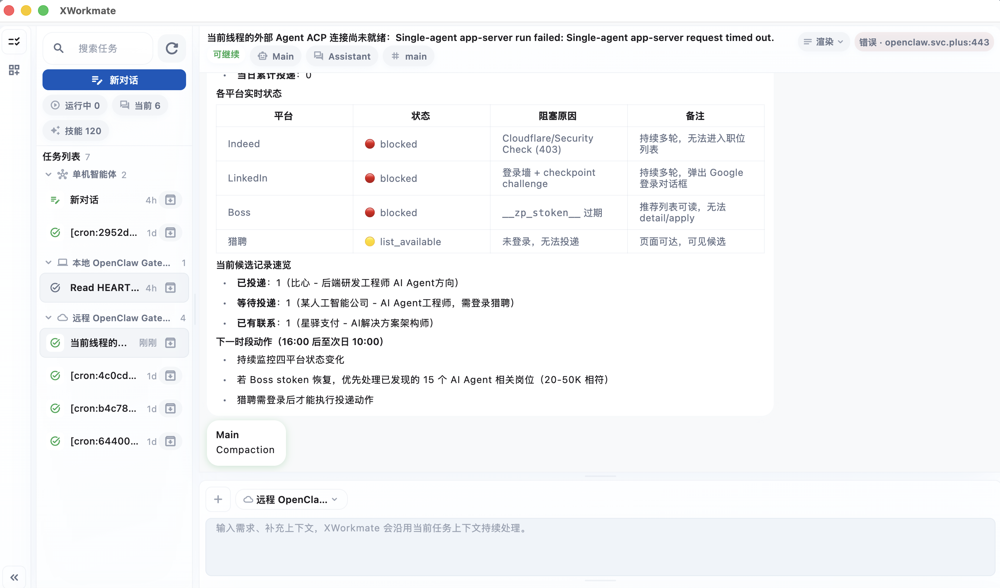
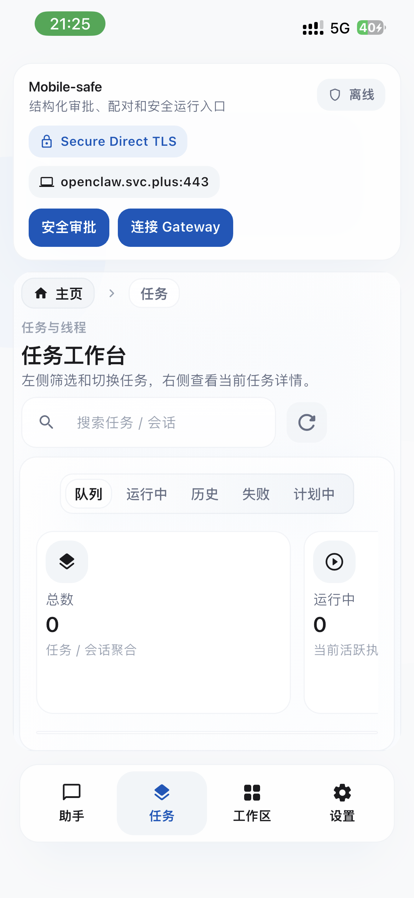
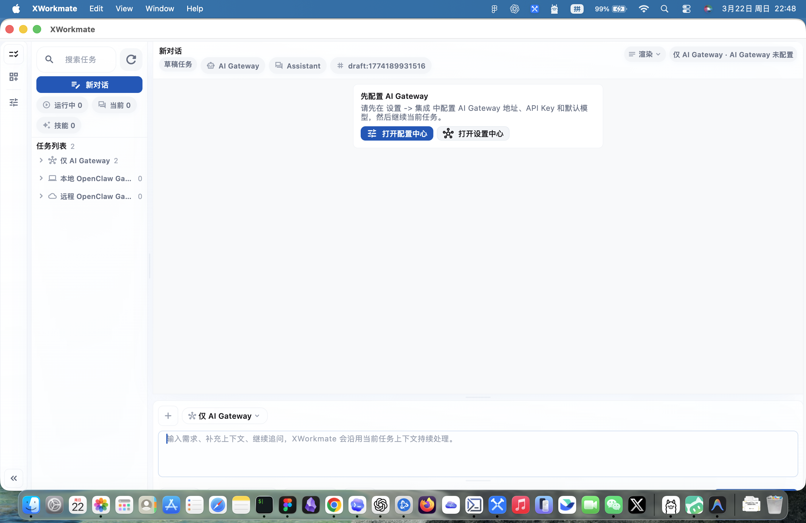

# XWorkmate

XWorkmate is a Flutter-based AI workspace shell for running assistant threads, local or remote gateway tasks, and multi-agent collaboration in one app.

## Project

XWorkmate combines a desktop-first Flutter app, persistent assistant task threads, and optional multi-agent orchestration.
It is designed for users who want a single workspace for AI chat, gateway-backed execution, and packaged local tooling across macOS, web, and other client surfaces.

## TL;DR

```bash
flutter pub get
flutter analyze
flutter test
flutter run -d macos
```

## Downloads

| Desktop | iOS | Android |
| --- | --- | --- |
| [](https://github.com/x-evor/xworkmate.svc.plus/releases/latest) | [](https://github.com/x-evor/xworkmate.svc.plus/releases/latest) | [](https://github.com/x-evor/xworkmate.svc.plus/releases/latest) |
| [](https://github.com/x-evor/xworkmate.svc.plus/releases/latest) | [](https://github.com/x-evor/xworkmate.svc.plus/releases/latest) | [](https://github.com/x-evor/xworkmate.svc.plus/releases/latest) |

All download buttons currently point to the latest GitHub release page.

## Snapshots

### Desktop



### Mobile



### Web



## Learn More

- [Release Notes](/Users/shenlan/workspaces/cloud-neutral-toolkit/XWorkmate.svc.plus/docs/releases/xworkmate-release-notes.md)
- [Changelog](/Users/shenlan/workspaces/cloud-neutral-toolkit/XWorkmate.svc.plus/docs/releases/xworkmate-changelog.md)
- [Feature Matrix](/Users/shenlan/workspaces/cloud-neutral-toolkit/XWorkmate.svc.plus/docs/planning/xworkmate-ui-feature-matrix.md)
- [Roadmap](/Users/shenlan/workspaces/cloud-neutral-toolkit/XWorkmate.svc.plus/docs/planning/xworkmate-ui-feature-roadmap.md)
- [Gateway Dev Runbook](/Users/shenlan/workspaces/cloud-neutral-toolkit/XWorkmate.svc.plus/docs/runbooks/gateway-dev-runbook.md)
- [Web Deployment](/Users/shenlan/workspaces/cloud-neutral-toolkit/XWorkmate.svc.plus/docs/web-deployment.md)
- [Security Rules](/Users/shenlan/workspaces/cloud-neutral-toolkit/XWorkmate.svc.plus/docs/security/secure-development-rules.md)
