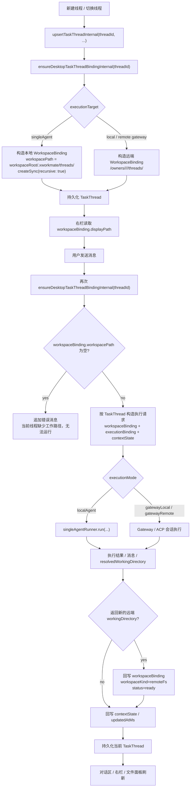
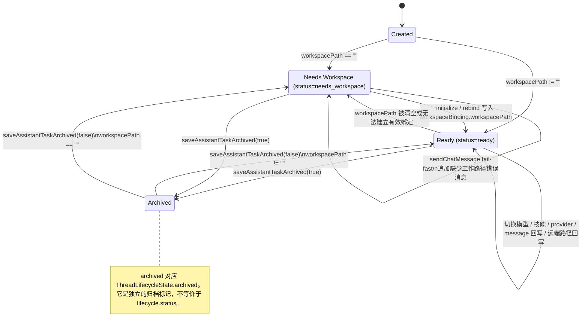

# Assistant TaskThread 当前模型（2026-03-28）

本文以当前代码实现为准，描述 XWorkmate 里 `TaskThread` 的真实结构、主链路和状态语义。

这份文档的目标不是描述“理想终态”，而是给现在的实现一份能直接对照代码的说明，避免旧的 `workspaceRef` 时代文档继续误导后续改动。

## 0. 当前结论

1. `TaskThread` 是当前任务线程的持久化主对象，规范字段已经是：
   - `ownerScope`
   - `workspaceBinding`
   - `executionBinding`
   - `contextState`
   - `lifecycleState`
2. desktop 发送消息前会先执行一次 `ensureDesktopTaskThreadBindingInternal(...)`，然后检查 `workspaceBinding.workspacePath`；为空则直接 fail-fast，不允许运行。
3. single-agent 本地线程会把工作目录落到：
   - `<settings.workspacePath>/.xworkmate/threads/<sanitized-threadId>`
4. 右侧边栏展示路径来自 `workspaceBinding.displayPath`；本地线程当前会把 `displayPath` 与 `workspacePath` 对齐，复制/打开也基于同一条绑定。
5. 当前 `ThreadLifecycleState.status` 在 desktop 主链路里实际只使用：
   - `needs_workspace`
   - `ready`
6. `archived` 是单独的布尔标记，不是第三个 `status` 枚举值。

## 1. 当前结构

### 1.1 顶层对象：TaskThread

```text
TaskThread
- threadId: String
- title: String
- ownerScope: ThreadOwnerScope
- workspaceBinding: WorkspaceBinding
- executionBinding: ExecutionBinding
- contextState: ThreadContextState
- lifecycleState: ThreadLifecycleState
- createdAtMs: double
- updatedAtMs: double?
```

### 1.2 归属：ThreadOwnerScope

```text
ThreadOwnerScope
- realm: ThreadRealm              // local | remote
- subjectType: ThreadSubjectType // tenant | user
- subjectId: String
- displayName: String
```

### 1.3 工作空间绑定：WorkspaceBinding

```text
WorkspaceBinding
- workspaceId: String
- workspaceKind: WorkspaceKind   // localFs | remoteFs
- workspacePath: String
- displayPath: String
- writable: bool
```

说明：

- `workspacePath` 是执行时真正依赖的路径。
- `displayPath` 是 UI 展示值。
- 对当前 desktop 本地线程，二者应保持一致。
- 对远端线程，`displayPath` 可以和 `workspacePath` 一样，也可以是更适合展示的字符串，但它们仍然来自同一个 `WorkspaceBinding`。

### 1.4 执行绑定：ExecutionBinding

```text
ExecutionBinding
- executionMode: ThreadExecutionMode
- executorId: String
- providerId: String
- endpointId: String
```

当前 `executionMode` 与 UI 目标的映射关系：

- `localAgent` -> `singleAgent`
- `gatewayLocal` -> `local`
- `gatewayRemote` -> `remote`

### 1.5 上下文：ThreadContextState

```text
ThreadContextState
- messages: List<GatewayChatMessage>
- selectedModelId: String
- selectedSkillKeys: List<String>
- importedSkills: List<AssistantThreadSkillEntry>
- permissionLevel: AssistantPermissionLevel
- messageViewMode: AssistantMessageViewMode
- latestResolvedRuntimeModel: String
- gatewayEntryState: String?
```

### 1.6 生命周期：ThreadLifecycleState

```text
ThreadLifecycleState
- archived: bool
- status: String                // 当前主链路只用 ready | needs_workspace
- lastRunAtMs: double?
- lastResultCode: String?
```

说明：

- `lastRunAtMs` / `lastResultCode` 已经是模型字段，但当前 desktop TaskThread 主链路还没有把它们扩展成更细的“运行中 / 成功 / 失败”状态机。
- 现在真正决定“能不能发消息”的核心条件仍然是 `workspaceBinding.workspacePath` 是否为空。

## 2. TaskThread 主流程图（Mermaid）

下面这张图对应当前 desktop 的真实主链路，覆盖线程初始化、工作目录绑定、运行前校验、执行与回写。



这张图里有三点最重要：

1. `TaskThread` 先绑定，再运行，不是运行时临时猜目录。
2. `workspaceBinding.workspacePath` 为空会直接失败，不会继续执行。
3. UI 展示路径和执行路径都来自同一个 `WorkspaceBinding`。

## 3. TaskThread 状态图（Mermaid）

下面这张图刻画的是当前实现真正存在的状态，不再把它画成一个比代码更复杂的“理想状态机”。



状态图里的关键现实约束：

1. 当前 desktop 链路没有单独维护 `running / succeeded / failed` 这些 TaskThread 生命周期状态。
2. “能不能运行”由 `workspacePath` 是否有效决定，所以 `needs_workspace` / `ready` 才是当前最重要的主状态。
3. `Archived` 更像“列表可见性 / 激活资格”开关，而不是替代 `status` 的主生命周期状态。

## 4. 当前实现里仍然存在的兼容痕迹

虽然持久化 canonical schema 已经是 `workspaceBinding` / `executionBinding` 这一套，但当前代码里仍然保留了少量旧入口作为适配层，例如：

- `TaskThread(...)` 构造器仍接受 `workspaceRef`
- `TaskThread(...)` 构造器仍接受 `workspaceRefKind`
- `TaskThread(...)` 构造器仍接受 `sessionKey`

这些字段现在主要用于：

- 老测试夹具
- 旧调用点平滑过渡
- 构造器内部映射到新结构

因此，当前最准确的理解方式是：

1. 运行时主对象已经是新结构。
2. 构造器层还残留少量旧参数适配。
3. 文档和后续重构都应以 `workspaceBinding` / `executionBinding` / `contextState` / `lifecycleState` 为主。

## 5. 文档边界

本文只描述当前 TaskThread 的主模型与主链路。

历史上那套以 `workspaceRef` / `workspaceRefKind` / fallback cwd 为中心的说明，已经降级为归档材料，不应再作为新改动的设计依据。
