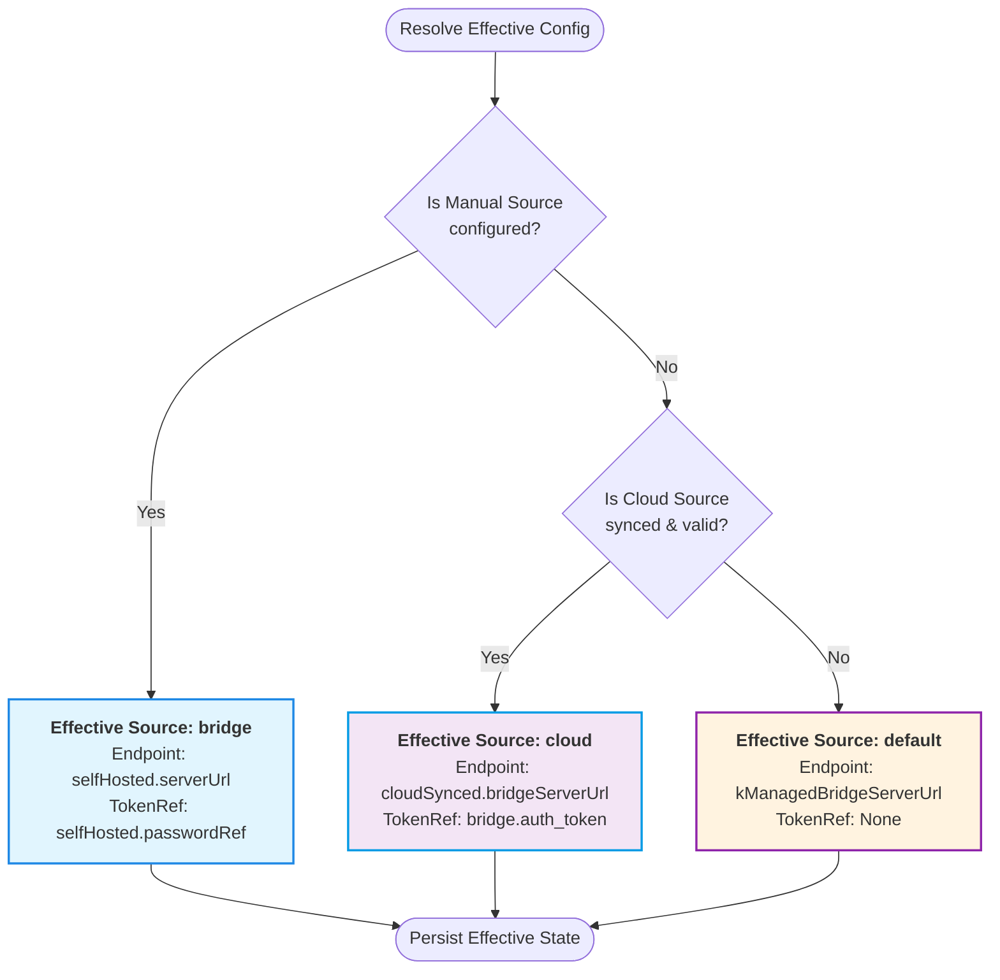

# Bridge Server Configuration Coexistence & Priority Resolution

Date: 2026-04-19

## Overview

The `xworkmate-app` utilizes a "Single Source of Truth" pattern for its Bridge Server configuration. While multiple configuration sources (Cloud Sync from `svc.plus` and Manual Bridge settings) can coexist, the system deterministically resolves them into a single **Effective Configuration** that the runtime consumes.

### Key Principles
- **Sources as Inputs:** Cloud and Bridge configurations are treated as sources, not mutually exclusive modes.
- **Deterministic Priority:** `Manual Bridge (Self-Hosted)` > `Cloud Sync (Managed)`.
- **Single Source of Truth:** The runtime exclusively uses the `AcpBridgeServerEffectiveConfig` object.
- **Explainability:** Each effective configuration includes a `source` tag and a `reason` explaining why it was selected.

## Configuration Model

The system maintains a clear separation between sources and the resolved state in `AcpBridgeServerModeConfig`.

```dart
class AcpBridgeServerModeConfig {
  final AcpBridgeServerEffectiveConfig effective; // Single Source of Truth
  final AcpBridgeServerCloudSyncConfig cloudSynced; // Source: svc.plus
  final AcpBridgeServerSelfHostedConfig selfHosted; // Source: Manual entries
}
```

### Resolution Logic (Mermaid Diagram)

The following diagram illustrates how the `resolveAcpBridgeServerEffectiveConfig` function implements the priority logic.



## Traceability & explaining the source

The `effective` configuration stores metadata that can be used for diagnostics or displayed in the UI:
- **`source`**: One of `bridge`, `cloud`, or `default`.
- **`reason`**: A human-readable string explaining the selection (e.g., "Manual Bridge configuration is present and valid").

## State Lifecycle

1. **On Save:** Whenever the user updates Manual Bridge settings in the UI, the effective config is recalculated.
2. **On Sync:** Whenever a successful Cloud Sync occurs, the effective config is recalculated.
3. **At Runtime:** Components like `resolveBridgeAcpEndpointInternal` simply read from `effective.endpoint` without needing to know about the underlying priority rules.
