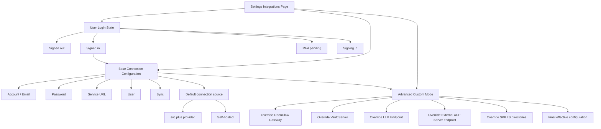

# Settings Integration Configuration Model

This document records the logical model behind the Settings -> Integrations page.

The page is organized into three layers:

- User login state
- Base connection configuration
- Advanced custom mode

The base connection layer is the default configuration surface. It represents the connection identity that can come from either `svc.plus` or a self-hosted service. Advanced custom mode does not replace the base layer; it overrides selected defaults on top of it.

## Notes

- User login state describes authentication only.
- Base connection configuration describes the default connection path and identity.
- Advanced custom mode is a layered override mechanism.
- The effective runtime configuration is computed from the base layer plus any advanced overrides.

