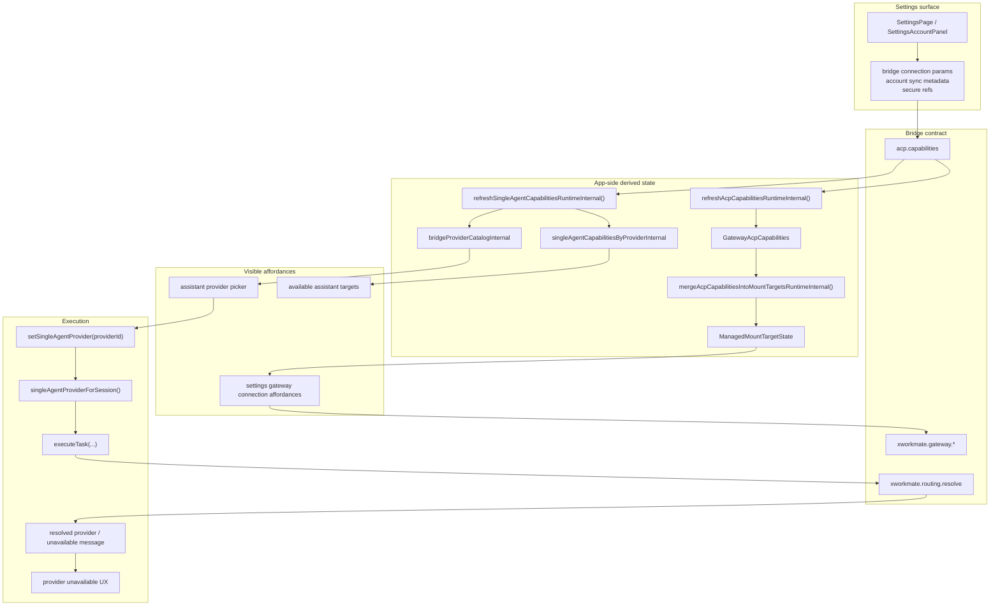

# Settings Integration Configuration Model

Last Updated: 2026-04-13

本文件记录当前 `Settings -> Integrations` 在主链中的职责边界。

## Current Rule

- Settings 只管理 bridge connection 参数与 account sync 元数据
- app 不从本地 endpoint preset、旧 module 配置、历史 fallback 恢复 provider catalog
- `xworkmate-bridge` 是 provider catalog、gateway capability、routing resolve 的唯一真源

## Bridge-Owned Source Of Truth

## What Settings Owns

- bridge host / transport / auth input
- account-linked bridge configuration metadata
- secure secret references
- gateway connection test / connect / disconnect affordance

## What Settings Does Not Own

- 独立 provider catalog
- 独立 module matrix
- app-side gateway preset backfill
- 旧 `ai_gateway` / `secrets` / `account` 页面壳

## Notes

- `providerCatalog` 只负责 assistant provider picker；不会因为线程里保存过 `providerId` 就被 app 反向重建
- gateway runtime 可见性来自 bridge capability snapshot 与 `xworkmate.gateway.*` 返回，不来自旧设置页枚举
- bridge 若返回额外 capability flag，这些 flag 只属于合同元数据，不会自动生成新的 settings tab 或 module page
- production provider / gateway 选择继续由 bridge 拥有，app 只保留消费与展示
