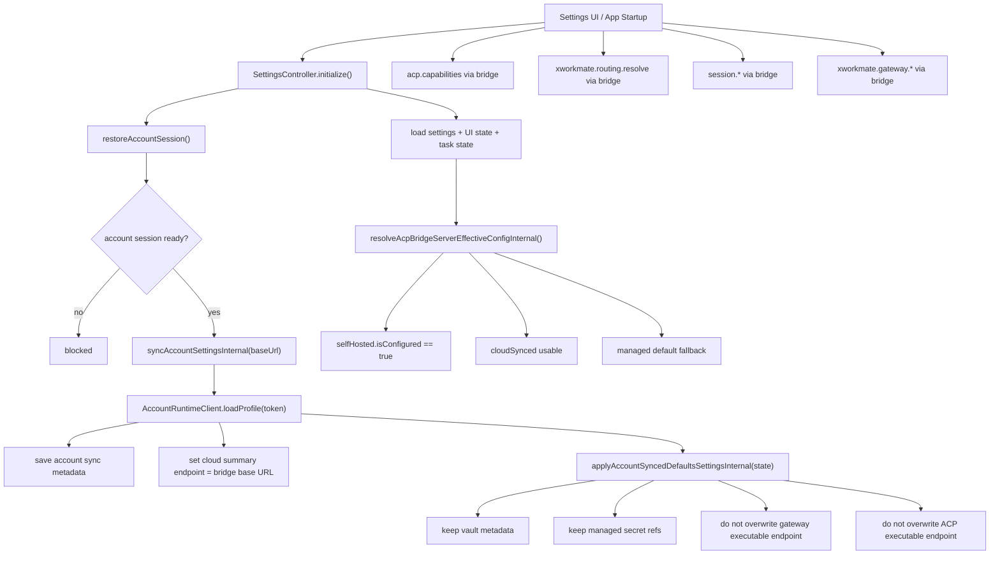

# Settings Config / State / Workflow Redesign

Status: Implementing V1

Date: 2026-04-19

Scope:
- `xworkmate-app`
- settings / account sync / cloud runtime state

## V1 Decision

Production cloud mode is bridge-owned, with explicit effective-config priority:

- `selfHosted` manual Bridge configuration has highest priority
- `cloudSynced` svc.plus configuration is the fallback when manual Bridge is not configured
- `default` managed server is the last-resort fallback
- app-facing cloud entry remains fixed to `https://xworkmate-bridge.svc.plus`
- production provider catalog is bridge-owned
- production gateway upstream is bridge-owned
- account sync is metadata-only for session state, status, and managed secret references
- account sync does not own executable ACP or gateway upstream endpoints

## Production Routing Truth

The app does not define or sync production upstreams.

Bridge-owned production routing is:

- `codex` -> `https://xworkmate-bridge.svc.plus/codex/acp/rpc`
- `opencode` -> `https://xworkmate-bridge.svc.plus/opencode/acp/rpc`
- `gemini` -> `https://xworkmate-bridge.svc.plus/gemini/acp/rpc`
- gateway -> `wss://openclaw.svc.plus`

The app only talks to:

- `https://xworkmate-bridge.svc.plus`

## App Responsibilities

- sign in to `accounts.svc.plus`
- persist account session and sync metadata
- call bridge runtime methods:
  - `acp.capabilities`
  - `xworkmate.routing.resolve`
  - `thread/start`
  - `turn/start`
  - `session.cancel`
  - `session.close`
  - bridge-owned gateway methods
- render bridge/provider/gateway status from bridge runtime results

## Removed Responsibilities

- no app-side direct-connect cloud path
- no production `xworkmate.providers.sync`
- no production provider catalog from `providerSyncDefinitions`
- no execution-time use of account-synced `openclawUrl`
- no execution-time use of account-synced `apisixUrl`
- no direct app calls to `xworkmate-bridge.svc.plus/*`
- no direct app calls to `openclaw.svc.plus`

## State Rules

`settings.yaml`

- stores current user settings and local editing state
- does not own production ACP upstream definitions
- does not get executable provider endpoints from account sync

`account/sync_state.json`

- stores synced account metadata only
- may retain `openclawUrl` / `apisixUrl` as account profile metadata
- does not overwrite executable cloud routing targets

`acpBridgeServerModeConfig.effective`

- represents the actual runtime source of truth
- resolves to `selfHosted` first, then `cloudSynced`, then `default`
- is what UI and runtime should read when deciding the active Bridge endpoint

`acpBridgeServerModeConfig.cloudSynced.remoteServerSummary.endpoint`

- represents bridge cloud entry only
- fixed to `https://xworkmate-bridge.svc.plus` while signed in and synced
- is not an upstream provider URL
- is not a gateway upstream URL

`acpBridgeServerModeConfig.selfHosted.serverUrl`

- represents the manual Bridge endpoint
- overrides cloud-synced bridge endpoint when configured
- is the first priority in effective-config resolution

## Workflow

## Invariants

- `providerSyncDefinitions` is not a production truth source.
- account sync may update metadata, but not production execution targets.
- gateway runtime status shown in the app must come from bridge runtime results.
- bridge capability/provider availability shown in the app must come from `acp.capabilities`.
- `effective` must never be inferred from stale local fallback state when `selfHosted` is configured.
- cloud sync is allowed to coexist with manual Bridge config, but it does not outrank it.
